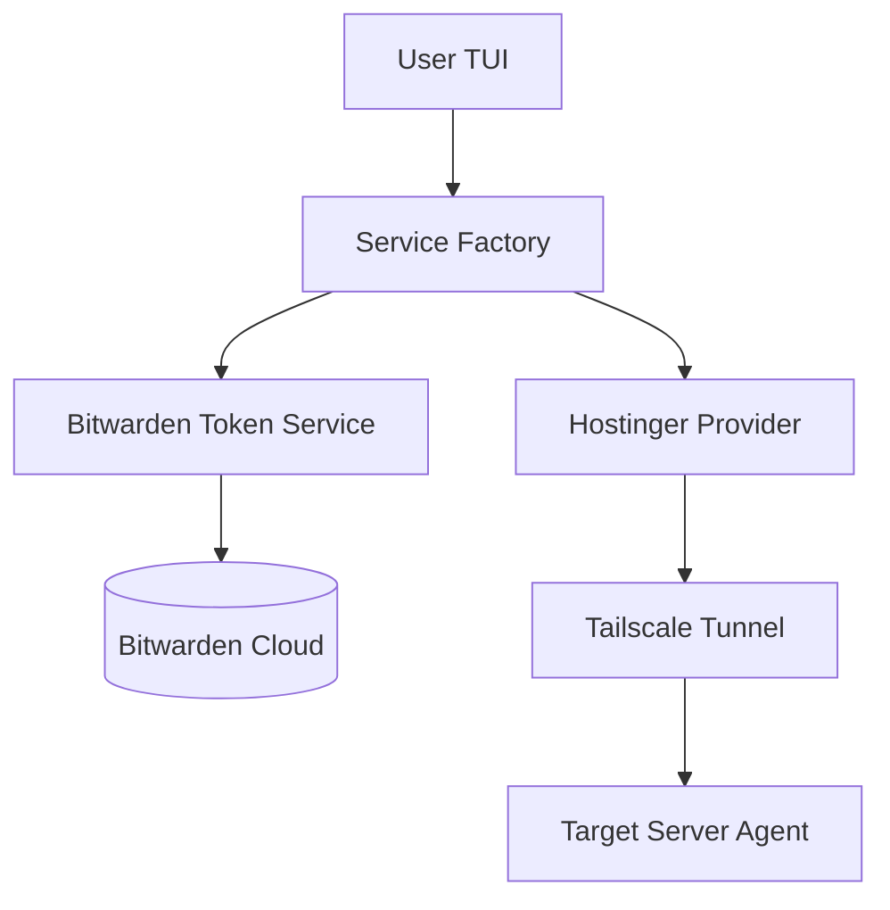

# Cloith Platform
> **Bridging the "Ops Gap": Professional-grade automation for secure, low-cost VPS orchestration.**

## The Mission: Democratizing Secure Hosting
Modern developers face a "Time vs. Money" dilemma: pay a massive premium for managed cloud platforms (AWS/Heroku) or struggle with the manual security "hustle" of a raw VPS.

**Cloith Platform** makes the "cheap naked VPS" option a professional reality. By automating critical provisioning and "Zero-Leak" security steps, this tool allows developers to maintain full control of their hardware without sacrificing the operational convenience of a managed service.

---

## Table of Contents
- [The "Ops Gap" Solution](#the-ops-gap-solution)
- [Security Philosophy](#security-philosophy)
- [Architecture](#architecture)
- [Key Features](#key-features)
- [Roadmap](#roadmap)
- [Reflections](#reflections-why-build-this)

---

## The "Ops Gap" Solution
Cloith targets the **Provisioning Phase**, turning a cheap "potato server" into a production-ready node:
*   **Automated Hardening:** One-click deployment of firewall rules, user permissions, and SSH hardening via Ansible.
*   **Mesh-First Networking:** Defaults to Tailscale to eliminate public-facing ports (SSH/K8s API).
*   **Secret Decoupling:** Bridges Bitwarden Vaults directly to raw infrastructure, ensuring secrets never live on the VPS disk in plain text.

---

## Architecture
Built with a modular **Service Factory** pattern to ensure the platform scales from managing local scripts to orchestrating complex cloud instances.

---

*Vault Services: Programmatic interaction with Bitwarden for credential lifecycle management.

*Provider Services: Pluggable drivers for Hostinger, Tailscale, and (future) AWS/GCP integrations.

*Lightweight Agents: A minimalist Python orchestrator designed to run on target servers, keeping the "Brain" safely on your local machine.

---

## Security Philosophy
For a highly secure environment, we follow a Defense in Depth strategy:

Identity: Multi-factor authentication via Bitwarden CLI with automatic session purging on exit.

Transport: 100% Mesh networking via Tailscale; No public IP exposure.

Execution: App runs in a hardware-isolated DevContainer, preventing kernel-level exploits on the host machine.

Statelessness: Secrets live in the cloud; management happens in memory.

## Key Features
Interactive TUI: A responsive dashboard built with the Textual framework and custom CSS.

IaC Integration: Native support for Terraform and Ansible playbooks.

Multi-Factor pexpect: Handles complex CLI interactions (like Bitwarden OTP) automatically.

Environment Agnostic: Optimized for both local laptop use and remote server orchestration.

## Roadmap
[x] Phase 1: Secret Management (Bitwarden CLI Integration).

[x] Phase 2: Modular Infrastructure (Service Factory & Folder Refactor).

[ ] Phase 3: Automated Hardening (Ansible "Zero-Leak" provisioning playbooks).

[ ] Phase 4: Cloud Bridge (AWS/EC2 management for hybrid-cloud setups).