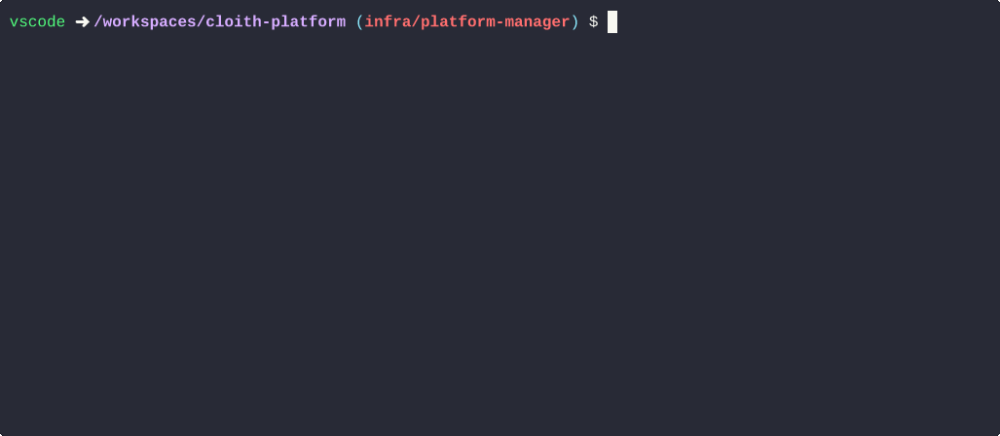

#### [🏠 Home](../README.md) 
---
# Platform Manager

The core orchestrator for Project Cloith. This tool handles secure environment bootstrapping, automated networking, and secret management.

## Quick Start
[View the Step-by-Step Tutorial](../platform-manager/docs/TUTORIAL.md)

---

## Technical Architecture
I have documented the specific engineering domains applied in this project. Click a category to see the implementation details:

### [Networking](../platform-manager/docs/NETWORKING.md)
| Implementation Details |
| :--- |
| Userspace Tunneling |
| SOCKS5 Proxying |

### [Security](../platform-manager/docs/SECURITY.md)
| Implementation Details |
| :--- |
| Zero-Persistence Secrets |
| Bitwarden MFA Auth |

### [Linux Systems](../platform-manager/docs/LINUX.md)
| Implementation Details |
| :--- |
| Kernel Locking (`fcntl`) |
| FIFO Pipes (`mkfifo`) |

### [Backend Logic](../platform-manager/docs/BACKEND.md)
| Implementation Details |
| :--- |
| Pexpect State-Logic |
| Error Interrogation |

### [Frontend & UX](../platform-manager/docs/FRONTEND.md)
| Implementation Details |
| :--- |
| Interactive Prompts (Questionary) |
| Visual Status Feedback (Rich) |

---
#### [🏠 Home](../README.md) 