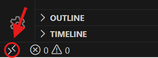
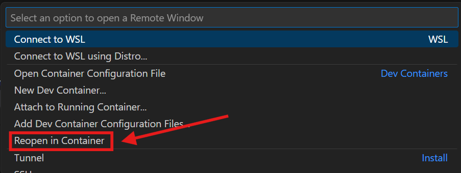
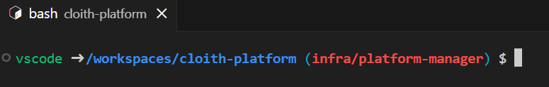
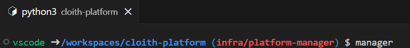
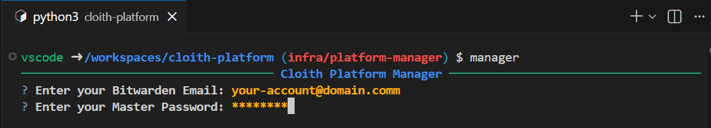
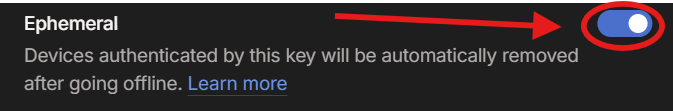
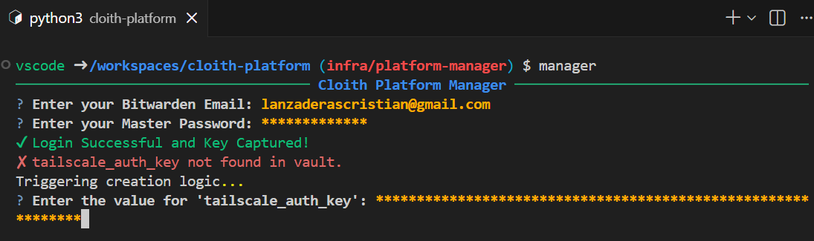

#### [🏠 Home](../../README.md) | [⬅️ Back](../README.md)
---
# Tutorial: Secure Infrastructure Deployment

This guide provides a step-by-step walkthrough for deploying automated infrastructure using the **Cloith-Platform Manager**. This project leverages **Dev Containers** for environment consistency and **Bitwarden** for zero-exposure secret management.

---

## Prerequisites

Ensure you have the following installed on your local machine:

* **Visual Studio Code**: The primary IDE for development and container integration.
* **Docker Desktop**: Required to host the automated development environment.
* **Bitwarden Account**: For secure storage of infrastructure secrets (SSH, API keys).
* **Tailscale Account**: To manage your private encrypted network overlay.

---

## Getting Started

### 1. Environment Setup

**Clone the Repository**
```bash
git clone [https://github.com/Cloith/cloith-platform.git](https://github.com/Cloith/cloith-platform.git)
cd cloith-platform
```
---

## Launch in Dev Container

Open the folder in Visual Studio Code.

### Click the Remote Window button



Select "Reopen in Container" from the command palette.


Note: This process ensures all dependencies like Python, Ansible, and the Bitwarden CLI are pre-configured within an isolated environment.

### 2. Authentication & Secrets
Once the container finishes building, open the VS Code integrated terminal:


Initialize Manager: Type manager in the terminal to start the CLI.


Bitwarden Login: Provide your Bitwarden email and Master Password when prompted.

Security Note: The session is handled in memory to prevent credential leaks to the disk.

### Tailscale Integration:
If you don't have the auth token, you can get it here:
[link](https://login.tailscale.com/admin/settings/keys)
---
Ensure the generated token has the Ephemeral option enabled to allow automatic cleanup of nodes.

Provide your Tailscale API Token.



### 3. Provisioning
Select Template: Choose "Deploy Template" from the CLI menu.

Hostinger API: Provide your Hostinger API Key when requested to authorize the VPS provisioning.

Execution: Sit back and wait for the Ansible Playbook to complete the configuration of your K3s cluster and secure networking.

### Security Best Practices
Zero-Exposure: Secrets are fetched directly from your Bitwarden vault and injected into the deployment process via RAM pipes.

Ephemeral Networking: By using ephemeral Tailscale keys, your infrastructure remains hidden from the public internet and automatically de-registers upon teardown.
---
#### [🏠 Home](../../README.md) | [⬅️ Back](../README.md)